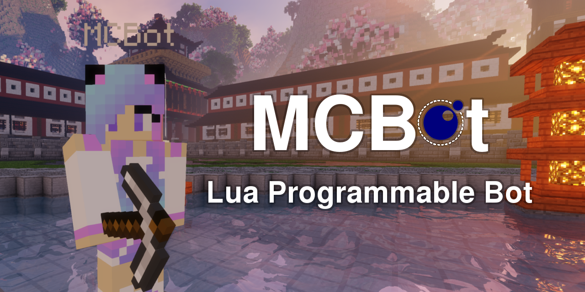

# MCBot - Lua Programmable Minecraft Bot

MCBot is a programmable Minecraft Bot built for 1.13 servers.
This bot can run Lua scripts and run automation tasks in game. 

Minecraft is a open-world voxel sandbox game with both single-player and multi-player capabilities.
Standard gameplay involves players surviving hostile creatures in game by building shelters and crafting
items in game with an optional route to "complete" the game.

## Features

This bot has a lot of neat features:

- Ability to be run on headless (CLI) servers, such as Debian Linux.
- Ability to load and execute scripts for task automation over a simple
  API using the Lua programming language without the worry of overhead syntax complexity.
- A* path finding integration for tracking players and being aware of the the world around it.
- Whitelisting friends that are allowed to execute commands over chat.
- Built-in commands for controlling the bot and viewing the bot status.

## Commands

This bot can be commanded and controlled using in-game commands
as well as CLI commands. Here's a list of all the commands that
are available. Required parameters are denoted as **<required>**
while optional parameters are denoted as **[optional]**.

If you are a friend of the bot, you can execute commands from
chat by prefixing your messages with the `!` symbol.

- `load <path>` - Load and execute a Lua script.
- `say <message>` - Send *message* to the chat. This can be prefixed with a forward-slash (/) to issue a server command.
- `move forward [blocks]` - Walk *n* number of blocks forward relative to which way the bot is facing.
- `goto <player>` - Find *player* and walk to their coordinates.
- `goto <x> <y> <z>` - Go to the coordinates *x*, *y*, *z* in the world.
- `friend <add/remove/list> [player]` - Add, remove, or list players the bot is friends with.

## Scripting

If you would like to automate the bot with pre-defined scripts,
you can create a `script.lua` file in the same directory as the
executable and pass in `--script script.lua` to
automatically load and execute the scripts when the bot connects. Or
you can issue the in game command `!load script.lua` which will
load and execute a script file on command. This can be done from
sub-directories as well.

An example script might look something like:

```lua
-- Send the message "Hello World" to chat
bot.sendMessage("Hello World!")

local function moveTurn()
	-- Move forward 3 blocks
	bot.moveForward(3)
	
	bot.rotateYaw(90)
end

for i=1, i<4 do
	-- Call function moveTurn()
	moveTurn()
	
	-- Wait 1000 milliseconds (1 second)
	bot.wait(1000)
end
```

## Lua API

All bot functions:

| Lua Function             | Return Type | Description                                                                                    |
|--------------------------|-------------|------------------------------------------------------------------------------------------------|
| bot.sleep(num)           | nil         | Delay thread execution for *num* milliseconds. Must be a positive integer.                     |
| bot.sendMessage(str)     | nil         | Send the string *str* to the chat.                                                             |
| bot.rotate(yaw, pitch)   | nil         | Rotate the bot's absolute *yaw* and *pitch* in degrees. (Yaw -180 to 180, Pitch -90 to 90).    |
| bot.rotateYaw(deg)       | nil         | Rotate the bot's yaw by *deg* degrees.                                                         |
| bot.rotatePitch(deg)     | nil         | Rotate the bot's pitch by *deg* degrees.                                                       |
| bot.moveForward(num)     | nil         | Move *num* blocks/meters forward, relative to the bot's current yaw angle.                     |
| bot.moveBackward(num)    | nil         | Move *num* blocks/meters backward, relative to the bot's current yaw angle.                    |
| bot.getHealth()          | float       | Get the current health. (Health 0.0 to 20.0).                                                  |
| bot.getHunger()          | int         | Get the current hunger. (Hunger 0 to 20).                                                      |
| bot.isDead()             | boolean     | Check if the current health is 0.0.                                                            |
| bot.getPosition()        | table       | Get the position as a table {x=int, y=int, z=int}.                                             |
| bot.getX()               | float       | Get the X position of the bot in the world.                                                    |
| bot.getY()               | float       | Get the Y position of the bot in the world.                                                    |
| bot.getZ()               | float       | Get the Z position of the bot in the world.                                                    |
| bot.getRotation()        | table       | Get the rotation as a table {yaw=float, pitch=float}                                           |
| bot.getYaw()             | float       | Get the Yaw rotation of the bot.                                                               |
| bot.getPitch()           | float       | Get the Pitch rotation of the bot.                                                             |
| bot.onMessage(func)      | nil         | Call a function *func(username, text)* with the username of the player and text of the player. |
| bot.onRawMessage(func)   | nil         | Call a function *func(text)* with text being the raw message from chat.                        |
| bot.onHealthChange(func) | nil         | Call a function *func(health, hunger)* with the health and hunger update.                      |
| bot.getUsername()        | string      | Get the username of the bot.                                                                   |


## Authors
- Anthony Waldsmith [awaldsmith0428@mpc.edu](mailto:awaldsmith0428@mpc.edu)
- Wade Costa [wcosta0336@mpc.edu](mailto:wcosta0336@mpc.edu)

## License

[MIT License](./LICENSE).
